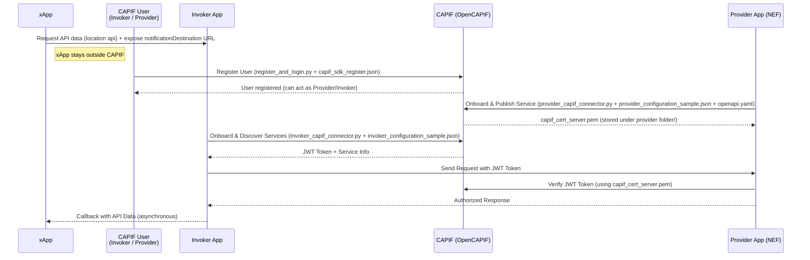
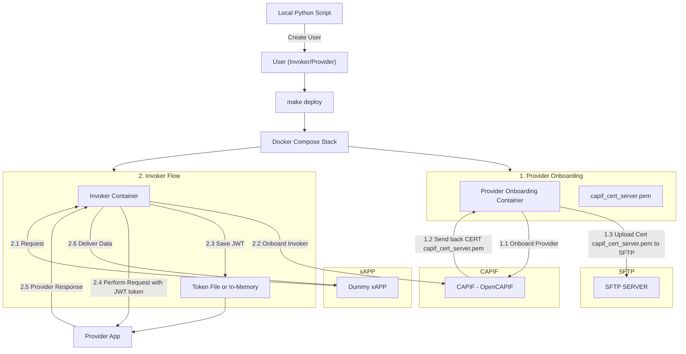
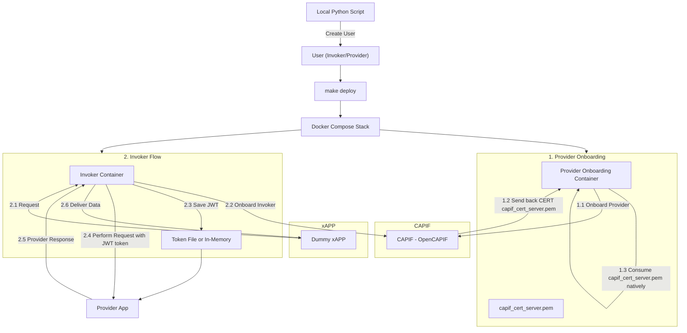

# OpenCAPIF Authorization Integration Template

This repository provides a **template** for integrating the [OpenCAPIF](https://labs.etsi.org/rep/ocf/capif) framework by the usage of [OpenCAPIF's SDK](https://labs.etsi.org/rep/ocf/sdk) to enable **authorization** for telecom APIs.  

It demonstrates how to onboard and authenticate **Provider** and **Invoker** applications through OpenCAPIF, using **FastAPI** for both service exposure and consumption.  

The current implementation showcases the **NEF MonitoringEvent API** as an example of a provider app that has been adjusted in order to support integration with the OpenCAPIF template and stored at [FRONT's](https://github.com/FRONT-research-group/NEF) github repo.

---

## 🚀 Architecture Overview

The repository includes:

- **Provider Onboarding App** (`FastAPI`)
  - Publishes a service API via OpenCAPIF.
  - Validates incoming requests using CAPIF-issued certificates and JWT tokens.

- **Invoker App** (`FastAPI`)
  - Discovers and consumes provider's services through OpenCAPIF.
  - Retrieves JWT tokens from CAPIF for authorized requests.

- **xAPP** (`FastAPI`)
  - Acts as an external application that consumes the data retrieved from the Invoker Application endpoint.  

- **Scripts**
  - `provider_capif_connector.py`:  
    Onboards the provider into OpenCAPIF, publishes services, and stores CAPIF’s returned certificate (`capif_cert_server.pem`) inside the `provider_folder/` folder.
  - `invoker_capif_connector.py`:  
    Onboards the invoker into OpenCAPIF, discovers available services, and retrieves a JWT token for consuming provider services that is stored under `invoker_folder/` as `txt`.
  - `register_and_login.py`:  
    Registers a new user in OpenCAPIF, enabling the user to act as **provider**, **invoker**, or both.
  - `dummy_app.py`:  
    Acts as the xAPP that consumes the data from invoker API while open a server in order invoker send back via callback the requested data.

- **Configuration Files**
  - `<provider/invoker>_config_sample.json`: Input for onboarding scripts (provider/invoker).
  - `capif_sdk_register.json`: Input for user registration.
  - `openapi.yaml`: The OpenAPI specification for the provider app service (used during service publication).
  - `.env`: File that includes environmental variables that is used in the bussiness flow for invoker/provider onboarding as well as invoker app. From there, anyone can configure either current location or last known location feature for provider app (NEF).

---

## 🔑 Workflow

1. **User Registration**  
   - A user is created in CAPIF using `register_and_login.py` with `capif_sdk_register.json`.  
   - The same user can be both a provider and an invoker depending on configuration.

2. **Provider Onboarding**  
   - The provider is onboarded to CAPIF via `provider_capif_connector.py` using `provider_configuration_sample.json`.  
   - The service is published using the provider's app **OpenAPI YAML schema**.  
   - CAPIF returns `capif_cert_server.pem`, stored under `provider_folder/`, used later for verifying JWT tokens.

3. **Invoker Onboarding & Discovery**  
   - The invoker is onboarded to CAPIF via `invoker_capif_connector.py` using `invoker_configuration_sample.json`.  
   - CAPIF provides service discovery results and returns a **JWT token**.  
   - This token allows the invoker to send **authorized requests** to the provider’s app.

4. **Authorized Communication(xAPP)**  
   - The invoker consumes the provider’s API upon request of **xAPP**.  
   - The provider verifies the JWT token against the CAPIF certificate (`capif_cert_server.pem`) to authorize requests.

---
## 📦 Prerequisites for Execution Guide  

Before deploying the full OpenCAPIF integration template, make sure the following are available:

1. **Running OpenCAPIF Instance**  
   You need a deployed and properly configured [OpenCAPIF](https://labs.etsi.org/rep/ocf/capif) and its [OpenCAPIF SDK](https://labs.etsi.org/rep/ocf/sdk).

2. **Python Environment**  
   - Create and activate a virtual environment.  
   - Install dependencies from `requirements.txt`.
   - These are used for **User Registration** and **Start the xAPP** steps  

3. **Docker & Make**  
   - Ensure both `docker` and `make` are installed for automated deployment.

4. **SFTP Server (Mandatory if docker compose provider profile is enabled)**  
   The deployment requires access to an **SFTP server** where capif_cert_server.pem certificate will be uploaded in order to be used from the provider app.  
   - Use the provided script to configure the SFTP server:  
     ```bash
     ./sftp_server_management.sh
     ```
   - The script allows you to define:  
     - **Server IP & Port**  
     - **Username & Password**  
     - **Files to import into the SFTP server**  

   Both **Provider** and **Invoker** onboarding flows depend on this certificate being properly accessible via SFTP in order provider authorize requests.  

⚠️ **Important:** Make sure the SFTP server is deployed and running  **before** executing `make deploy`. Without it, provider onboarding and deployment will fail since CAPIF certificate cannot be retrieved or uploaded.  

## ⚡ Execution Guide

This section describes how to run the repository step by step.  

Before the execution steps see more information for the deployment of the template in the **Notes** section at the end of that section.

1. **User Registration**

  First, register a new user in OpenCAPIF. This user can later act as a **provider**, **invoker**, or both depending on the configuration.
  ```bash
  cd ocf-net-app-integration/user_creation/
  python register_and_login.py
  ```
2. **Provider Onboarding & Service Publication**
   
  Onboard the provider into OpenCAPIF and publish its services.
  ```bash
  cd ocf-net-app-integration/provider_impl/
  python provider_capif_connector.py
  ```
3. **Invoker Onboarding & Service Discovery**
   
  Onboard the invoker and discover available services.
  ```bash
  cd ocf-net-app-integration/invoker_impl/app/invoker_onboarding/
  python invoker_capif_connector.py
  ```
4. **Start the Invoker App**
   
  Run the invoker app to consume the provider’s service with authorized requests:
  ```bash
  cd ocf-net-app-integration/
  PYTHONPATH=invoker_impl python invoker_impl/invoker_app/main.py
  ```
5. **Start the Provider App**
   
  Run the provider app to expose the published service:
  You shoud see [NEF's guide](https://github.com/FRONT-research-group/NEF/blob/integrate_security/README.md) in case you want to use it as provider app.

6. **Start the xAPP**

Run the xAPP dummy app to consume invoker's api and receive provider's app data:
```bash
cd ocf-net-app-integration/xAPP
python dummy_app.py
```
## 📝 Notes

### Deployment Automation
- Steps **2, 3, and 4** (Provider onboarding, Invoker onboarding, and Invoker app startup) are bundled into a single **docker-compose** stack.
- You can deploy them together with:
```bash
cd ocf-net-app-integration/
make deploy
```

During deployment, **Docker will create (if not already present) an external network** to enable communication with an external provider application.  

Make sure this external resource, after the creation via **Make target rule**, is properly defined in the `docker-compose.yaml` file.  

⚠️ **Before running `make deploy`, ensure that the SFTP server is running and configured** (see [📦 Prerequisites](#-prerequisites-for-execution-guide))

### Deployment Uninstall  

To undeploy the stack, run:  
```bash
cd ocf-net-app-integration/
make clean
```
`make clean` should remove the created containers, volumes, and the external network.  
If the external Docker network still exists, remove it manually or run again the `make clean`, after undeploying the provider app resource dependency:  
```bash
docker network rm shared
```

### Offboarding from CAPIF

Currently, offboarding invoker from the CAPIF is not supported, so anyone can undeploy the capif and redeploy again to have a clean setup.  
Offboarding the provider from the CAPIF is supported for a more robust experimentation, by executing the **provider_offboard.py** script after copying the provider_folder of the configured user from the container to a local folder.
For example:
```bash
docker cp provider_onboard:/app/provider_folder/ppavlidis/ ./provider_folder/ppavlidis/
python provider_offboard.py
```

---

## 📊 Sequence Diagram


---

## 📊 FlowChart Diagram (via SFTP Case)



## 📊 FlowChart Diagram (via non-sftp)

