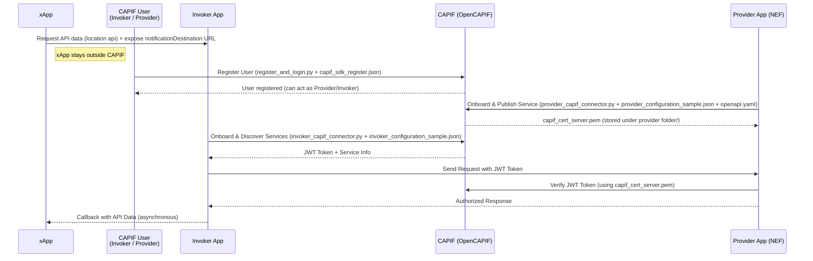
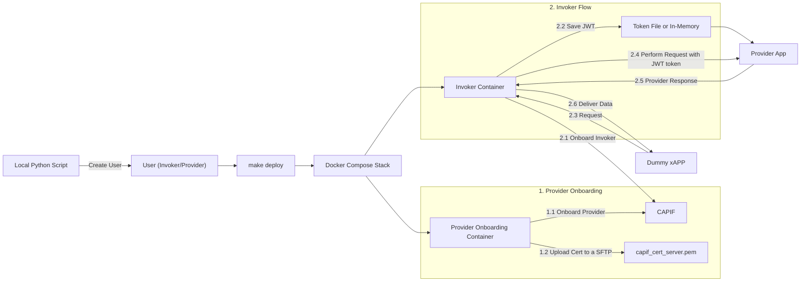

# OpenCAPIF Authorization Integration Template

This repository provides a **template** for integrating the [OpenCAPIF](https://labs.etsi.org/rep/ocf/capif) framework by the usage of [OpenCAPIF's SDK](https://labs.etsi.org/rep/ocf/sdk) to enable **authorization** for telecom APIs.  

It demonstrates how to onboard and authenticate **Provider** and **Invoker** applications through OpenCAPIF, using **FastAPI** for both service exposure and consumption.  

The current implementation showcases the **NEF MonitoringEvent API** as an example of a provider app that has been adjusted in order to support integration with the OpenCAPIF template and stored at [FRONT's](https://github.com/FRONT-research-group/NEF/tree/integrate_security) github repo.

---

## 🚀 Architecture Overview

The repository includes:

- **Provider Onboarding App** (`FastAPI`)
  - Publishes a service API via OpenCAPIF.
  - Validates incoming requests using CAPIF-issued certificates and JWT tokens.

- **Invoker App** (`FastAPI`)
  - Discovers and consumes provider's services through OpenCAPIF.
  - Retrieves JWT tokens from CAPIF for authorized requests.

- **xAPP** (`FastAPI`)
  - Acts as an external application that consumes the data retrieved from the Invoker Application endpoint.  

- **Scripts**
  - `provider_capif_connector.py`:  
    Onboards the provider into OpenCAPIF, publishes services, and stores CAPIF’s returned certificate (`capif_cert_server.pem`) inside the `provider_folder/` folder.
  - `invoker_capif_connector.py`:  
    Onboards the invoker into OpenCAPIF, discovers available services, and retrieves a JWT token for consuming provider services that is stored under `invoker_folder/` as `txt`.
  - `register_and_login.py`:  
    Registers a new user in OpenCAPIF, enabling the user to act as **provider**, **invoker**, or both.
  - `dummy_app.py`:  
    Acts as the xAPP that consumes the data from invoker API while open a server in order invoker send back via callback the requested data.

- **Configuration Files**
  - `<provider/invoker>_config_sample.json`: Input for onboarding scripts (provider/invoker).
  - `capif_sdk_register.json`: Input for user registration.
  - `openapi.yaml`: The OpenAPI specification for the provider app service (used during service publication).
  - `.env`: File that includes environmental variables that is used in the bussiness flow for invoker/provider onboarding as well as invoker app.

---

## 🔑 Workflow

1. **User Registration**  
   - A user is created in CAPIF using `register_and_login.py` with `capif_sdk_register.json`.  
   - The same user can be both a provider and an invoker depending on configuration.

2. **Provider Onboarding**  
   - The provider is onboarded to CAPIF via `provider_capif_connector.py` using `provider_configuration_sample.json`.  
   - The service is published using the provider's app **OpenAPI YAML schema**.  
   - CAPIF returns `capif_cert_server.pem`, stored under `provider_folder/`, used later for verifying JWT tokens.

3. **Invoker Onboarding & Discovery**  
   - The invoker is onboarded to CAPIF via `invoker_capif_connector.py` using `invoker_configuration_sample.json`.  
   - CAPIF provides service discovery results and returns a **JWT token**.  
   - This token allows the invoker to send **authorized requests** to the provider’s app.

4. **Authorized Communication(xAPP)**  
   - The invoker consumes the provider’s API upon request of **xAPP**.  
   - The provider verifies the JWT token against the CAPIF certificate (`capif_cert_server.pem`) to authorize requests.

---

## ⚡ Execution Guide

This section describes how to run the repository step by step.  
Make sure you have a running instance of [OpenCAPIF](https://labs.etsi.org/rep/ocf/capif) and the [OpenCAPIF SDK](https://labs.etsi.org/rep/ocf/sdk) properly configured.  
Also make sure to create a virtual environment and install `requirements.txt` file before executing the steps below for **user registration** and **xAPP** python scripts.  
Lastly, make sure that you have **docker** and **make** installed.  
Before the execution steps see more information for the deployment of the template in the **Notes** section at the end of that section.

1. **User Registration**

  First, register a new user in OpenCAPIF. This user can later act as a **provider**, **invoker**, or both depending on the configuration.
  ```bash
  cd ocf-net-app-integration/user_creation/
  python register_and_login.py
  ```
2. **Provider Onboarding & Service Publication**
   
  Onboard the provider into OpenCAPIF and publish its services.
  ```bash
  cd ocf-net-app-integration/provider_impl/
  python provider_capif_connector.py
  ```
3. **Invoker Onboarding & Service Discovery**
   
  Onboard the invoker and discover available services.
  ```bash
  cd ocf-net-app-integration/invoker_impl
  python invoker_capif_connector.py
  ```
4. **Start the Invoker App**
   
  Run the invoker app to consume the provider’s service with authorized requests:
  ```bash
  cd ocf-net-app-integration/
  PYTHONPATH=invoker_impl python invoker_impl/invoker_app/main.py
  ```
5. **Start the Provider App**
   
  Run the provider app to expose the published service:
  You shoud see [NEF's guide](https://github.com/FRONT-research-group/NEF/blob/integrate_security/README.md) in case you want to use it as provider app.

6. **Start the xAPP**

Run the xAPP dummy app to consume invoker's api and receive provider's app data:
```bash
cd ocf-net-app-integration/xAPP
python dummy_app.py
```
**Notes**:  
**Deployment automation**  
Steps 2,3,4 is composed in one docker compose file that is deployed via a make target rule. Having that in mind for step 2,3,4 you can just run the following:
```bash
cd ocf-net-app-integration/
make deploy
```
One more step to have in mind is that while make deploy is called, **docker creates** if not exist, a **external docker network** that needs to communicate with an external provider application.  
That resource then should be declared appropriately in the **docker-compose.yaml**.  
**Deployment uninstall**  
For undeploy, run the make target below and after the undeploy of the provider app as well you should run `docker network rm shared` or the `make clean` target again to remove the external docker network.
```bash
cd ocf-net-app-integration/
make clean
```
---

## 📊 Sequence Diagram


---

## 📊 FlowChart Diagram

